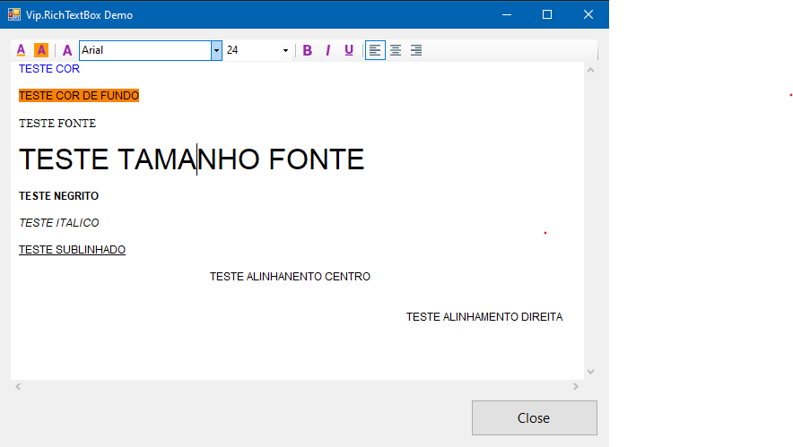

<h2 align="center"><strong>Vip.RichTextBox</strong> - A custom RichTextBox control for WinForms :page_facing_up:</h2> 

  
  
  
  
  

    

## Requisites

- .Net Framework 4.5+

## Options

- Font color
- Font background color
- Font size
- Align
- Bold
- Italic
- Underline

## License
MIT

